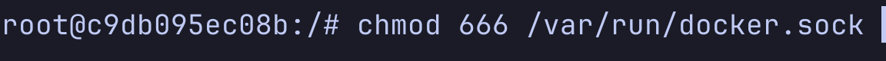
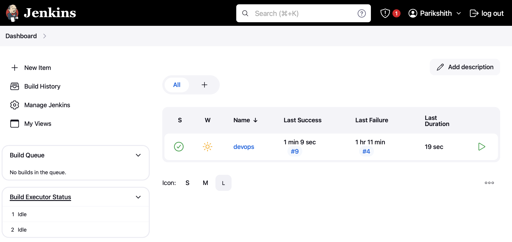
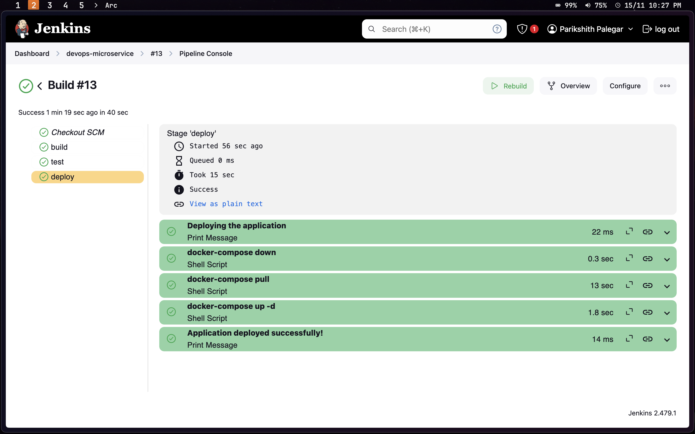

# DevOps Microservices Application


This repository is a practical implementation of a microservices-based architecture using modern DevOps principles. It features multiple backend services, a frontend interface, containerization using  Docker, and a Jenkins-based CI/CD pipeline to automate deployment.

The application is fully operational with an established CI/CD pipeline.

---

## Table of Contents

- [Project Overview](#project-overview)
- [Features](#features)
- [Technology Stack](#technology-stack)
- [Setup Instructions](#setup-instructions)

---

## Project Overview

This project demonstrates the development and deployment of a microservices-based architecture with containerization and automated CI/CD processes. The application consists of multiple backend services, a frontend for user interaction, and orchestration using Docker Compose.

---

## Features

- **Microservices Architecture**: Independent services for handling authentication, note-taking, and product-related tasks.
- **Frontend Integration**: A responsive and interactive UI built using modern frontend frameworks.
- **Containerized Deployment**: All services are packaged as Docker containers for seamless deployment.
- **CI/CD Pipeline**: Jenkins automates building, testing, and deploying services.
- **Database Integration**: Persistent storage with database migrations for `auth-service` and `notes-service`.

---
## Technology Stack

- **Backend**: Go, Javscript
- **Frontend**: Next.js, TailwindCSS
- **Containerization**: Docker
- **Orchestration**: Docker Compose
- **CI/CD**: Jenkins
- **Database**: PostgreSQL

---

## Setup Instructions

### 1. Deploy Jenkins to a Remote Server Using Docker

To deploy Jenkins with moutining volumes to allow jenkins to run docker commands, run the following command in your terminal:

```bash
docker run -p 8080:8080 -p 50000:50000 -d \
-v jenkins_home:/var/jenkins_home \
-v /var/run/docker.sock:/var/run/docker.sock \
-v $(which docker):/usr/bin/docker jenkins/jenkins:lts

```

**Note:** I am using `ufw` to manage firewall. Open port 8080 with this command: `sudo ufw allow 8080/tcp`

Enter the jenkins conatiner as root and give permission to run docker commands
```bash
docker exec -u 0 -it <conatiner-id> /bin/bash
```



### 2. Access the Jenkins UI

Once Jenkins is running, open your web browser and navigate to:
`http://<your-server-ip>:8080`

### Setup Admin Account

Follow the instructions on the setup page to create an admin account.




We have three services 
1. Auth services
2. Notes services
3. Front end

### Main pipeline files
```txt
.
├── Jenkinsfile
│ 
├── auth-service
│   ├── Dockerfile
│  
├── docker-compose.yml
│
├── frontend
│   ├── Dockerfile
│ 
├── notes-service
│   ├── Dockerfile
│
├── product-service
│   ├── Dockerfile
```

Each have there Dockerfile in respective folder. And a docker-compose.yml at the root to run them all at once in a single docker network.

**Note:** We have a postgresql database managed in docker-compose which is accessed by both notes-service & auth-service

---


## Jenkins pipeline 

1. Build images and push them to docker hub ( credentials are  configured in Jenkins dashboard )
2. Test step
3. Deploy: Run docker compose
    - Pull latest images from docker hub (which is public)
    - Loads the environment variables
    - Runs images in a single docker network while exposing port 3000 to access front-end, 3002 for product-service API
```groovy

pipeline {
    agent any
    
    stages {
        stage("build") {
            steps {
                echo "Building images"
                withCredentials([usernamePassword(credentialsId: 'docker-hub', passwordVariable: 'PWD', usernameVariable: 'USER')]) {
                    sh 'docker build -t pariksh1th/devops:frontend frontend/'
                    sh 'docker build -t pariksh1th/devops:notes-service notes-service/'
                    sh 'docker build -t pariksh1th/devops:auth-service auth-service/'
                    sh 'docker build -t pariksh1th/devops:product-service product-service/'
                    sh "echo $PWD | docker login -u $USER --password-stdin"
                    sh 'docker push pariksh1th/devops:frontend'
                    sh 'docker push pariksh1th/devops:notes-service'
                    sh 'docker push pariksh1th/devops:auth-service'
                    sh 'docker push pariksh1th/devops:product-service'
                }
            }
        }
        
        stage("test") {
            steps {
                echo "Testing application"
                // Add your test commands here
            }
        }
        
        stage("deploy") {
            steps {
                echo "Deploying the application"

                // stop running containers
                sh 'docker-compose down'

                // Pull latest images
                sh 'docker-compose pull'
                
                // Deploy with docker-compose
                sh 'docker-compose up -d'

                echo "Application deployed successfully!"
            }
        }
    }
}
```





