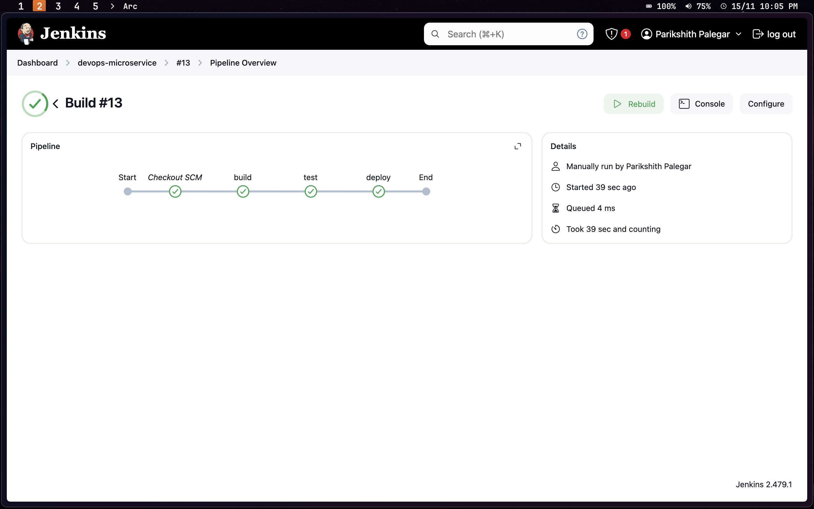

# DevOps Microservices Application

This repository showcases a microservices architecture with backend services, a frontend interface, and Docker containerization. It includes a Jenkins-driven CI/CD pipeline for automated deployment and is fully operational.

---

## Table of Contents

- [Project Overview](#project-overview)
- [Features](#features)
- [Technology Stack](#technology-stack)
- [Architecture and Sequence Diagram](#architecture-and-sequence-diagram)
- [Setup Instructions](#setup-instructions)

---

## Project Overview

This project showcases a microservices-based architecture with containerization, featuring multiple backend services, a user-facing frontend, and orchestration via Docker Compose. It also integrates automated CI/CD pipelines for streamlined development and deployment.

---

## Features

- **Microservices**: Independent services for authentication, note-taking, and product management.
- **Frontend**: Responsive UI built with modern frameworks.
- **Containerization**: Dockerized services for easy deployment.
- **CI/CD**: Jenkins automates build, test, and deployment processes.
- **Database**: Persistent storage with migrations for `auth-service` and `notes-service`.

---
## Technology Stack

- **Backend**: Go, Javscript
- **Frontend**: Next.js, TailwindCSS
- **Containerization**: Docker
- **Orchestration**: Docker Compose
- **CI/CD**: Jenkins
- **Database**: PostgreSQL

---
## Architecture and Sequence Diagram

- The application follows a **microservices architecture**, separating concerns between the frontend and backend services.
- Below is the sequence diagram of this application.


### Architecture Overview

This system follows a client-server architecture with separate services for authentication, notes management, and product management. The flow of interactions is as follows:

1. **Frontend**: The user interacts with the UI, sending requests for login, notes retrieval, and product operations.
2. **Auth Service**: Validates user credentials and issues JWT tokens for authenticated sessions.
3. **Notes Service**: Manages user notes by fetching and displaying data from the database.
4. **Product Service**: Handles product-related operations, including adding and deleting products, by interacting with the database.
5. **Database**: Stores user credentials, notes, and product data, supporting CRUD operations.

This architecture ensures a modular, secure, and scalable approach to user and product management.


## Setup Instructions

### 1. Deploy Jenkins to a Remote Server Using Docker

To deploy Jenkins with moutining volumes to allow jenkins to run docker commands, run the following command in your terminal:

```bash
docker run -p 8080:8080 -p 50000:50000 -d \
-v jenkins_home:/var/jenkins_home \
-v /var/run/docker.sock:/var/run/docker.sock \
-v $(which docker):/usr/bin/docker jenkins/jenkins:lts

```

**Note:** I am using `ufw` to manage firewall. Open port 8080 with this command: `sudo ufw allow 8080/tcp`

Enter the jenkins conatiner as root and give permission to run docker commands
```bash
docker exec -u 0 -it <conatiner-id> /bin/bash
```


### 2. Access the Jenkins UI

Once Jenkins is running, open your web browser and navigate to:
`http://<your-server-ip>:8080`

### Setup Admin Account

Follow the instructions on the setup page to create an admin account.


We have three services 
1. Auth services
2. Notes services
3. Front end

### Main pipeline files
```txt
.
├── Jenkinsfile
│ 
├── auth-service
│   ├── Dockerfile
│  
├── docker-compose.yml
│
├── frontend
│   ├── Dockerfile
│ 
├── notes-service
│   ├── Dockerfile
│
├── product-service
│   ├── Dockerfile
```

Each have there Dockerfile in respective folder. And a docker-compose.yml at the root to run them all at once in a single docker network.

**Note:** We have a postgresql database managed in docker-compose which is accessed by both notes-service & auth-service

---


## Jenkins pipeline 

1. Build images and push them to docker hub ( credentials are  configured in Jenkins dashboard )
2. Test step
3. Deploy: Run docker compose
    - Pull latest images from docker hub (which is public)
    - Loads the environment variables
    - Runs images in a single docker network while exposing port 3000 to access front-end, 3002 for product-service API
```groovy

pipeline {
    agent any
    
    stages {
        stage("build") {
            steps {
                echo "Building images"
                withCredentials([usernamePassword(credentialsId: 'docker-hub', passwordVariable: 'PWD', usernameVariable: 'USER')]) {
                    sh 'docker build -t pariksh1th/devops:frontend frontend/'
                    sh 'docker build -t pariksh1th/devops:notes-service notes-service/'
                    sh 'docker build -t pariksh1th/devops:auth-service auth-service/'
                    sh 'docker build -t pariksh1th/devops:product-service product-service/'
                    sh "echo $PWD | docker login -u $USER --password-stdin"
                    sh 'docker push pariksh1th/devops:frontend'
                    sh 'docker push pariksh1th/devops:notes-service'
                    sh 'docker push pariksh1th/devops:auth-service'
                    sh 'docker push pariksh1th/devops:product-service'
                }
            }
        }
        
        stage("test") {
            steps {
                echo "Testing application"
                // Add your test commands here
            }
        }
        
        stage("deploy") {
            steps {
                echo "Deploying the application"

                // stop running containers
                sh 'docker-compose down'

                // Pull latest images
                sh 'docker-compose pull'
                
                // Deploy with docker-compose
                sh 'docker-compose up -d'

                echo "Application deployed successfully!"
            }
        }
    }
}
```




